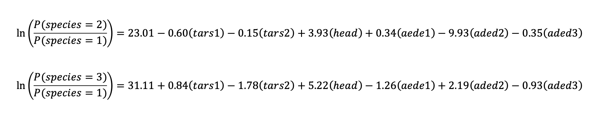

```{r setup, include=FALSE}
knitr::opts_chunk$set(echo = TRUE)
# The setup chunk is run automatically before any other code to make sure package requirements are satisfied
# library(tidyverse)
# library(ggplot2)
# Add more packages here
# library(nnet)
# library(class)
# library(MASS)
```

# Thinking Through Nearest Neighbors.

(a) What would happen if the number of neighbors equals the number of cases in the training sample? \
- If we choose the number of K (neighbors) to be the number of training sample, the predictions of each testing datapoint will always be a class that has the largest number of data in the training sample. According to the ISLR, this is called a null model because it gives the same result every time we make predictions. \

(b) What would happen if the number of neighbors is 1? Does this even make sense? Explain.\
- If the number of neighbors (K) is 1, the class of testing data will always be assigned to the class of closest training data, which is overly flexible. I don't believe using this K=1 makes sense because the closeness between training and testing data might occur by chance and thus leads to extremely overfitting. \

(c) Suggest a method for selecting a reasonable number of neighbors.\
- To select an appropriate number of neighbors(K), I would plot testing error rates with 1/K. I would expect that the testing errors will result a U-shape. I would pick a reasonable number of neighbors(K) at the minimum of the U-shape in the testing errors. If the testing errors are not U-shape, I would pick K where the errors drop significantly.


```{r}

# (d)  Apply the method you proposed in the previous section to the crab data in the MASS package:

library(MASS)
head(crabs) # Top 6 rows
dim(crabs) # Dimension of the data

summary(crabs)
# Observation of crabs:
# No missing values, data are all numerical, and no obvious outliers

# Create crab's type based on sp and sex
crabs.class = rep("1", 200) # Create an empty vector with 200 indices 
crabs.class[crabs$sp == "B" & crabs$sex == "F"] = "2" # Assign class 
crabs.class[crabs$sp == "O" & crabs$sex == "M"] = "3" 
crabs.class[crabs$sp == "O" & crabs$sex == "F"] = "4" 
# Assign classes to crabs dataframe
# B,M = "1"; B,F = "2"; O,M = "3"; O,F = "4"
crabs$class = crabs.class

head(crabs) # Show top 6 rows to confirm the assigned crab class

# Split train and test to prepare for KNN with 80:20 rules by class.
# In other words, for each class, the number of training data is 40 and testing data is 10;

crab.class1 = crabs[crabs$class == "1", ]  # Select rows with class = "1", all columns
crab.class1_train = crab.class1[1:40,] # Select the first 40 rows as training observations
crab.class1_test = crab.class1[41:50,] # Select the last 10 rows as testing observations

crab.class2 = crabs[crabs$class == "2", ]  # Select rows with class = "2", all columns
crab.class2_train = crab.class2[1:40,] # Select the first 40 rows as training observations
crab.class2_test = crab.class2[41:50,] # Select the last 10 rows as testing observations

crab.class3 = crabs[crabs$class == "3", ]  # Select rows with class = "3", all columns
crab.class3_train = crab.class3[1:40,] # Select the first 40 rows as training observations
crab.class3_test = crab.class3[41:50,] # Select the last 10 rows as testing observations

crab.class4 = crabs[crabs$class == "4", ]  # Select rows with class = "4", all columns
crab.class4_train = crab.class4[1:40,] # Select the first 40 rows as training observations
crab.class4_test = crab.class4[41:50,] # Select the last 10 rows as testing observations

# Append training data
crab.train = rbind(crab.class1_train, crab.class2_train)
crab.train = rbind(crab.train, crab.class3_train)
crab.train = rbind(crab.train, crab.class4_train)
dim(crab.train) # check dimensions of training data; results are as expected

# Append testing data
crab.test = rbind(crab.class1_test, crab.class2_test)
crab.test = rbind(crab.test, crab.class3_test)
crab.test = rbind(crab.test, crab.class4_test)
dim(crab.test) # check dimensions of testing data; results are as expected

## Perform KNN
library(class)

set.seed(1) # a seed must be set in order to ensure reproducibility of results.

max_k = 40 # Define the maximum k 
error.testing  = vector(length = length(max_k)) # create a blank testing errors vector
for (i in 1:max_k) {
  knn.pred = knn(crab.train[, c(4:8)], crab.test[, c(4:8)], crab.train$class, k = i)
  error.testing[i]  = mean(knn.pred != crab.test$class)   # Fill testing errors
}


# Plot a graph as suggested in (c)
plot(1/1:max_k, error.testing, type = "b", xlab='1/K', ylab='Test Errors')
# According to this plot, I would choose 1/K equal to 0.2 (k=5) because this is
# where the test errors drop significantly even though this plot might not be the 
# U-shape as I expected.

# Build a model with k=5 
knn.pred <- knn(crab.train[, c(4:8)], crab.test[, c(4:8)], crab.train$class, k = 5)
# For each point of test dataset, knn finds the closest 5 training points, and choose a 
# class based on maximum voting.
table(knn.pred, crab.test$class)

# e) Comment on your findings
mean(knn.pred == crab.test$class) # Accuracy
mean(knn.pred != crab.test$class) # Error rate
# Precision of class 1 is 1/1  = 100%
# Recall for class 1   is 1/10 = 10%
# Precision of class 2 is 3/3  = 100%
# Recall for class 2   is 3/10 = 30%
# Precision of class 3 is 1/5  = 20%
# Recall for class 3   is 1/10 = 10%
# Precision of class 4 is 10/31 = 32.6%
# Recall for class 4   is 10/10 = 100%

# According to the results of KNN with k=5, the model is doing a terrible job trying to 
# classify the crab types. We can see that the total testing accuracy is only 37.5% which 
# performs worsen than randomly guess the class. Moreover, precision and recall for each class
# are also poor and not reliable. For these reasons, I conclude that we should not 
# use this model, and should find other classification methods to predict the class using 
# 5 morphological measurements. Because of completely non-parametric approach, KNN
# performs poorly when we have a small number of training data or a lot of independent variables(p).
# If we would like to improve the accuracy, I would try other methods such as NaiveBeyes
# that work well with small number of data, which depends on independent variables assumption.

```

## Logistic Regression vs Linear Discriminant Analysis.

```{r}

## Loading the flea dataset
flea = read.csv(file = "flea.csv", header = TRUE)

head(flea) # Print the top 6 rows
dim(flea)  # Print dimensions of the data

table(flea$species) # Count distinct class
summary(flea[, c(-1)]) # Understand how the data behave
# Observation of flea:
# No missing values, data are all numerical, and no obvious outliers


# Since we have a very small sample for each class (21 22 31), I choose to not split the data
# into training and test dataset. Therefore, I would compare the accuracy of these methods using 
# training accuracy and errors.

# Normally, the Logistic Regression in glm cannot handle multiple classes.
# Thus, I will separate the data into 3 datasets as the following.
flea.1 = flea
flea.1[flea.1$species != 1,]$species = 0

flea.2 = flea
flea.2[flea.2$species != 2,]$species = 0

flea.3 = flea
flea.3[flea.3$species != 3,]$species = 0

# Each dataset contains only its class and 0

```


```{r}

## Fit Logistic regression on each dataset

# Flea1
# Put all variables into the logistic regression model 
glm1.fits <- glm(
  species ~ tars1 + tars2 + head + aede1 + aede2 + aede3, data = flea.1, family = binomial
)
summary(glm1.fits) # 

# However, I got the warning that " glm.fit: algorithm did not converge"
# and p-values of all variables are extremely large. Therefore, I cannot use this model
# and this approach.
```

```{r}
# Another approach is the Logistic Regression that can handle multiclass
# using multinom function

library(nnet)

logistic.model  = multinom(species ~ tars1 + tars2 + head + aede1 + aede2 + aede3, data = flea)
logistic.output = summary(logistic.model)
logistic.output 
```

With multinomial logistic regression, the model treats class 1 as the baseline.\
Note: different choices of baseline give different coefficients but the log adds will stay the same.\
Logistic regression is originated by linear regression, but used logistic function to give smooth curves.
To fit the model, the method uses maximum likelihood to estimate betas hat.\
The following equations demonstrate the predicted betas(coefficients) of the estimated logistic regression.
```{r out.width = '100%'}

```
To interpret the coefficient, for example, a one-unit increase in tars1 would increase the log odds of species=3 over species=1 by 0.84.

```{r}
# Since multinom does not provide and p-values , I will compute them using 
# the following command
z = logistic.output$coefficients/logistic.output$standard.errors # Calculate Z-value
p = (1 - pnorm(abs(z), 0, 1)) * 2 # Two tail z-test
print("P-values of the model")
p

# Since all the p-values for each variable are much larger than 0.05, indicating that 
# the association between these variables and dependent variables occur by chance,
# I believe that something might go wrong with the model, but I cannot further investigate
# because of the time constants.

# Predict using training observations
logistic.pred <- predict(logistic.model)

table(logistic.pred, flea$species)   # Count predict values with Y
mean(logistic.pred == flea$species)  # Accuracy
mean(logistic.pred != flea$species)  # Error rate

## Interpretation of the accuracy
# According to the model performance based on training observations,
# the model perfectly classify each class, indicating by accuracy of 100% and
# the error rate of 0%. However, we need to keep in mind that we use training 
# observations, not test observations. We might get a poor performance 
# when we use test dataset because of overfitting. When we get 100% accuracy, I believe 
# something might go wrong with our model because we cannot reduce irreducible errors.
# I am of the opinion that we need to get more data to further verify this model.
# With the available data, I cannot make conclusion on how this model actually performs.
```


```{r}
## LDA
library(MASS)
lda.fit <- lda(species ~ tars1 + tars2 + head + aede1 + aede2 + aede3, data = flea)

# LDA is a type of generative models where it makes assumptions about the data.
# Specifically, LDA assumes that f(x) of k is normal distribution, and each class
# has the constant variance. QDA, on the other hands, assumes that each class has 
# its own variance.
lda.fit
# LDA output provides prior probability of each class that corresponds to 
# the number of datapoint in each class. It also provides group means that will be
# used in to estimate the population means in unknowable world of each class.
# The coefficients of linear discriminants of each variable provide are used to form decision
# boundary using equation 4.24 in ISLR. 

plot(lda.fit)
# This plot is computed by multiplying the coefficients of 
# linear discriminants with each training observations.
# We can see that the model accurately separate each class.


# Predict using training observations
lda.pred <- predict(lda.fit)

lda.class <- lda.pred$class # Obtain the class from prediction
table(lda.class, flea$species)
mean(lda.class == flea$species)  # Accuracy
mean(lda.class != flea$species)  # Error rate

## Interpretation of the accuracy
# According to the model performance based on training observations,
# the model perfectly classify each class, indicating by accuracy of 100% and
# the error rate of 0%. However, we need to keep in mind that we use training 
# observations, not test observations. Again, we might get a poor performance 
# when we use test dataset because of overfitting. 
# Without the additional data, I cannot make conclusion on how this model actually performs.
```
Since both models give the same results, additional testing data are required to compare and choose the best model.